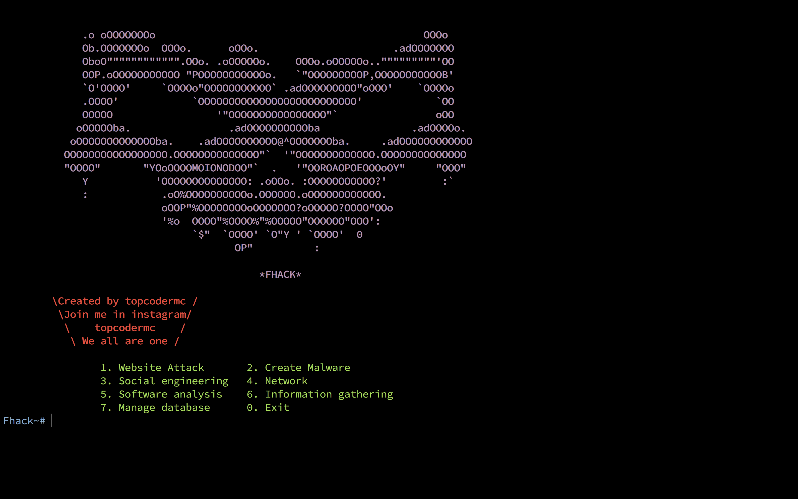

# FHack

FHack is Automation of hacking

# ABOUT.

Fhack is free and open source freamework for penetration testing and hacking. So if you wanna do something bad please wait.
We coming soon.

# Community

|name | post | Email |
----------|------------|-------|
|topcoder|creator and programmer|topcodermc@gmail.com

     

# SUPPORTED DISTRIBUTIONS
|Distribution | Version Check | supported | dependencies already installed |status |
----------|-------|------|------|-------|
|Debian(8)|1.0 | yes| yes | working   |
|MACOS|1.0|yes|yes|working|

# INSTALLATION
For the installation of FHack framework it's necesary to install all [dependencies](https://github.com/PowerScript/KatanaFramework/wiki/Requisites) for a good performance.
<pre><i><n>git clone https://github.com/topcoder-mc/FHack.git
cd FHack
sudo -s
pip install -r libs_used 
</pre></i></n>
